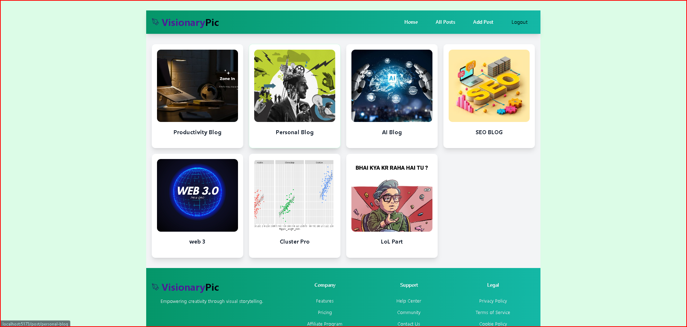
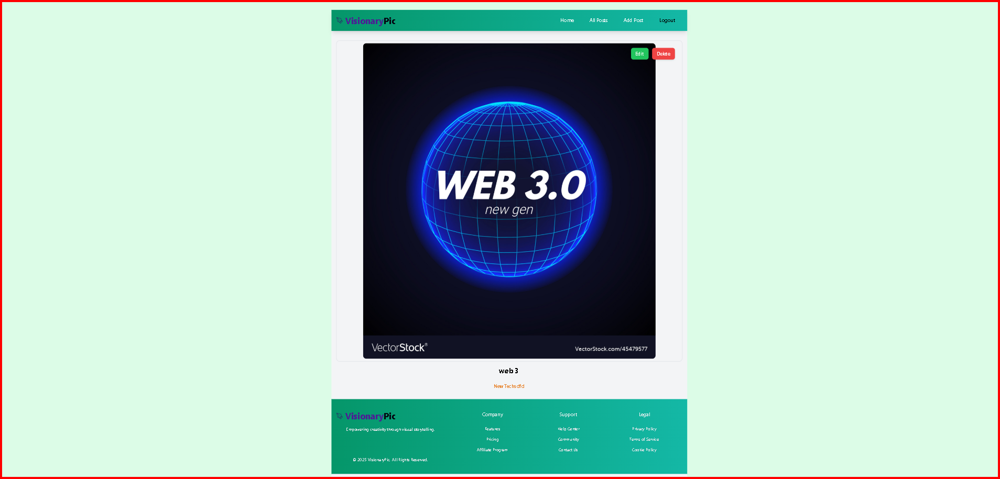

# VisionaryPic - Blog Platform

VisionaryPic is a modern blog platform built with React, Redux, and Appwrite. It features a clean, responsive design and allows users to create, edit, and manage blog posts with rich text content and image uploads.

## 📸 Screenshots

### Authentication Pages

*User registration with email and password*

*Clean and simple login interface*

### Blog Features

*Dashboard showing various blog categories including Productivity, AI, SEO, and Web3*

*Rich text editor with image upload capability*

### Sample Post Type

## 🌟 Features

- 🔐 User authentication (signup, login, logout)
- 📝 Create, edit, and delete blog posts
- 🖼️ Image upload support for post thumbnails
- 📱 Responsive design
- 🔍 Rich text editor integration
- 🎨 Modern UI with Tailwind CSS
- 🔄 State management with Redux
- 🚀 Backend powered by Appwrite

## 🛠️ Technologies Used

- React.js
- Redux Toolkit
- React Router DOM
- Appwrite
- TinyMCE Editor
- Tailwind CSS
- React Hook Form
- HTML React Parser

## 🚀 Getting Started

### Prerequisites

- Node.js (v14 or higher)
- npm or yarn
- Appwrite instance (local or cloud)

## Create a `.env` file in the root directory with your Appwrite credentials:

- VITE_APPWRITE_URL="Your-Appwrite-URL"
- VITE_APPWRITE_PROJECT_ID="Your-Project-ID"
- VITE_APPWRITE_DATABASE_ID="Your-Database-ID"
- VITE_APPWRITE_COLLECTION_ID="Your-Collection-ID"
- VITE_APPWRITE_BUCKET_ID="Your-Bucket-ID"

## 🔑 Key Features Implementation

### Authentication
- Secure user authentication using Appwrite
- Protected routes with AuthLayout component
- Redux state management for auth status

### Blog Posts
- Rich text editor for post content
- Image upload functionality
- CRUD operations for posts
- Responsive post cards and layout

### UI/UX
- Modern and clean design
- Responsive navigation
- Loading states and error handling
- Form validation

## 🤝 Contributing

Contributions are welcome! Please feel free to submit a Pull Request.

## 📝 License

This project is licensed under the MIT License - see the LICENSE file for details.

## 🙏 Acknowledgments

- [Appwrite](https://appwrite.io/) for the backend services
- [TinyMCE](https://www.tiny.cloud/) for the rich text editor
- [Tailwind CSS](https://tailwindcss.com/) for the styling

